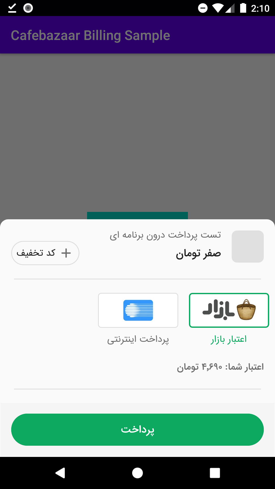

# CafeBazaarInAppBilling   پرداخت درون برنامه ای کافه بازار




## پیاده سازی پرداخت درون برنامه ای کافه بازار 

<p dir="rtl"> مرحله 1. اضافه کردن کتابخانه ی CafebazaarInAppBilling به برنامه  </p>

<p dir="rtl">1.1- اضافه کردن خطوط زیر به build.gradle روت پروژه:</p>

    allprojects {
        repositories {
          ...
          maven { url 'https://jitpack.io' }
      }
    }

<p dir="rtl">2.1- اضافه کردن کتابخانه به برنامه:</p>

    dependencies {
        implementation 'com.github.softrunapp:CafeBazaarInAppBilling:1.0.3'
    }

<p dir="rtl">3.1- اضافه کردن Java8 به برنامه:</p>

    android {
        ...
        compileOptions {
            sourceCompatibility JavaVersion.VERSION_1_8
            targetCompatibility JavaVersion.VERSION_1_8
        }
    }


<p dir="rtl"> مرحله 2. دریافت RSA و SKU از کافه بازار</p>


<p dir="rtl">1.2- از برنامه خروجی ریلیز بگیرید و در پنل کافه بازار آپلود کنید</p>
<p dir="rtl">2.2- پس از بارگزاری برنامه در پنل کافه بازار در تب پرداخت درون برنامه ای کلید RSA رو خواهید دید و به تعدادی که نیاز دارید با دکمه ی محصول جدید SKU بسازید. دقت داشته باشید منظور از SKU شناسه ی کالا می باشد.</p>

<p dir="rtl">مرحله 3. پیاده سازی پرداخت درون برنامه ای کافه بازار در اپلیکیشن</p>


<p dir="rtl">کد های کلاس اکتیویتی را به شکل زیر تغییر بدید</p>

```java
public class MainActivity extends AppCompatActivity implements CafebazaarBillingListener {
     
     private CafebazaarBilling cafebazaarBilling;
     @Override
      protected void onCreate(Bundle savedInstanceState) {
                       super.onCreate(savedInstanceState);
                       setContentView(R.layout.activity_main);
                       
                        cafebazaarBilling = new CafebazaarBilling.Builder(this)
                               .setRsaKey(rsaKey) // کلید RSA که در مرحله ی قبل دریافت کردید
                               .setBillingListener(this)
                               .build();

                  Button purchase = findViewById(R.id.purchase);
                  purchase.setOnClickListener(view -> 
                          cafebazaarBilling.purchase(SKU)); // این متد با استفاده از اس کا یو که از مرحله قبل دریافت کردید اقدام به ارتباط با کافه بازار و خرید محصول میکنه و دیالوگ خرید کافه بازار رو به کاربر نشون میده
       }

    @Override
     protected void onDestroy() {
         super.onDestroy();
         cafebazaarBilling.onDestroy(); 
      }

     @Override
     protected void onActivityResult(int requestCode, int resultCode, @Nullable Intent data) {
          cafebazaarBilling.onActivityResult(requestCode, resultCode, data);
          super.onActivityResult(requestCode, resultCode, data);
       }

  @Override
   public void ConnectingToBazaar() {
           // این متد زمانی صدا زده می شود که برنامه در شروع اجرای ارتباط با کافه بازار است که در این متد می توانید یک لودینگ نمایش دهید 
   }

   @Override
   public void onConnectedToBazaar() {
        // زمانی که با موفقیت به کافه بازار متصل شد این متد نمایش داده می شود
    }

    @Override
    public void onIabPurchaseFinished(Purchase purchase) {
         // زمانی که خرید با موفقیت انجام می شود خرید به این متد برگردانده می شود که میتوانید خرید را به سرور برنامه خودتون ارسال کنید 
        // اگر خرید شما از نوع مصرفی است باید خرید را مصرف کنید اگر به سرور ارسال میکنید در جواب برگشتی سرور متد زیر را صدا بزنید. یا اگر برنامه سرور ندارد همینجا متد مصرف را صدا بزنید:
              
          cafebazaarBilling.consumePurchase(purchase);
     }

   @Override
   public void onConsumeFinished() {
         // این متد زمانی صدا زده می شود که خرید از نوع مصرفی بوده و خرید مصرف شده باشد
    }

   @Override
   public void onQueryInventoryFinished(Inventory inventory) {
        // این متد خرید های کاربر را برمی گرداند که اگر خرید مصرفی مصرف نشده باشد می توانید مصرف کنید
   }

   @Override
   public void () {
          // این متد زمانی صدا زده می شود که کاربر خرید را لغو کند
   }

   @Override
   public void onFailed(String message) {
         // اگر خطایی در روند خرید رخ دهد این متد صدا زده می شود
   }
}
```

<p dir="rtl"> متد هایی که صدا زده می شوند:</p>

```java
    cafebazaarBilling.purchase(SKU)); // خرید محصول
    cafebazaarBilling.consumePurchase(purchase); // مصرف محصول خریداری شده
    cafebazaarBilling.queryInventoryAsync(); // لیست محصولات خریداری شده
```
